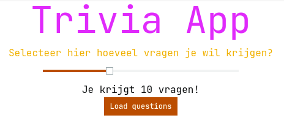
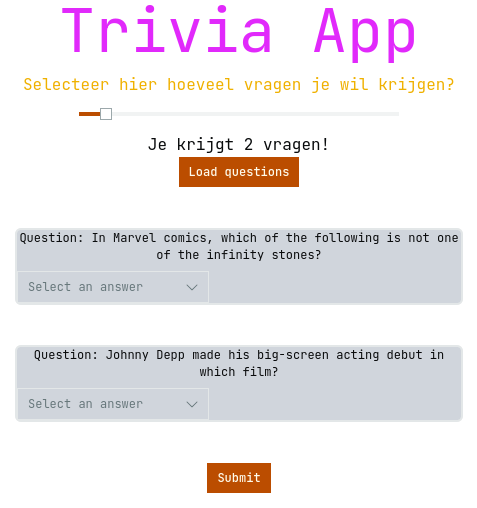
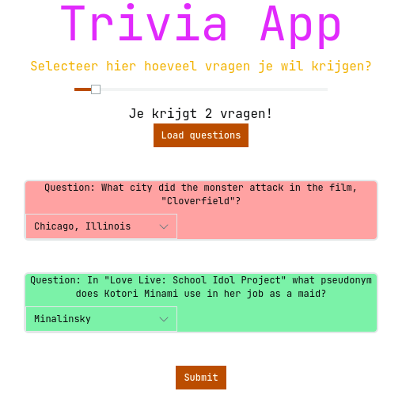

# Trivia applicatie

Welkom bij deze trivia applicatie.  
Je kunt hier leuke vragen beantwoorden in diverse categorieën

## Gebruik

### Openingsscherm

Wanneer je de applicatie opent, zie je het volgende scherm:

  

Verplaats de slider om te bepalen hoeveel vragen je krijgt.   
Druk vervolgens op de knop "Load questions".   
Je krijgt nu het volgende te zien:

### Vragenscherm

  

Elk "blok" is een vraag en bevat een drop-down menu met de antwoordmogelijkheden.  
Het is nu de bedoeling dat je voor elke vraag een antwoord kiest.  
Heb je dat gedaan, klik dan op de knop "Submit" die onderaan de vragenlijst staat.  
Je antwoorden worden nu gecontrolleerd.

### antwoordenshcerm

  

Het vragen blok wordt groen als je antwoord goed is en rood als je antwoord fout is.  

## Troubleshooting

Het kan voorkomen dat je vragen blok rood omlijnt wordt.  
Dit betekend dat er iets mis is gegaan.  
Het best kun je nu de pagina herladen.
